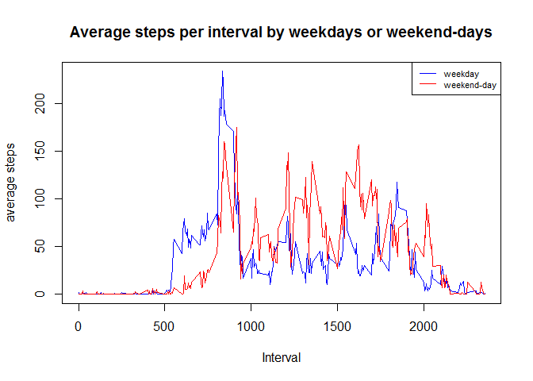

# Assignment1
##Loading and preprocessing the data
First of all the library knitr has to be loaded and echo has to be set to true throughout this assignment.

Then I set my working directory to where my data is. 

Afterwards the data is loaded in.

But date has to be converted into a date-format.

```r
library(knitr)
opts_chunk$set(echo = TRUE)

setwd("C:/Users/CRP/Dropbox/DataScience/ReproduceData/Ass1/")
data<-read.csv("activity.csv")


data$date<- strptime(data$date, format = "%Y-%m-%d") 

#just checking if everything is OK
head(data)
```

```
##   steps       date interval
## 1    NA 2012-10-01        0
## 2    NA 2012-10-01        5
## 3    NA 2012-10-01       10
## 4    NA 2012-10-01       15
## 5    NA 2012-10-01       20
## 6    NA 2012-10-01       25
```

```r
str(data$date)
```

```
##  POSIXlt[1:17568], format: "2012-10-01" "2012-10-01" "2012-10-01" "2012-10-01" ...
```

##What is mean total number of steps taken per day?
First, the steps per day are created through the aggregate function.

Then a histogram is shown.

And lastly the question of the mean and the median is answered.


```r
steps_per_day<-aggregate(list(steps=data$steps),by=list(day=cut(data$date, "1 day")),sum)


hist(steps_per_day[,2],breaks=20,main="Histogram of steps per day",xlab="Steps per day")
```

<!-- -->

```r
mean_steps_per_day<-mean(steps_per_day[,2],na.rm=TRUE)
mean_steps_per_day
```

```
## [1] 10766.19
```

```r
median_steps_per_day<-median(steps_per_day[,2],na.rm=TRUE)
median_steps_per_day
```

```
## [1] 10765
```
Thus the mean is 10788.19 and the median is 10765.

##What is the average daily activity pattern?

The following code creates first a variable with all the average steps in the respective intervals.

Then the plot is shown.

In the end the interval with the highest amount of steps is calculated.


```r
interval_mean<-aggregate(list(steps=data$steps),by=list(interval=data$interval),mean,na.rm=TRUE)


plot(interval_mean[,1],interval_mean[,2],type="l")
```

<!-- -->

```r
interval_mean[which.max(interval_mean[,2]),]
```

```
##     interval    steps
## 104      835 206.1698
```
The answer for the question is that the interval 835 has the highest amount of steps (206.17).

##Imputing missing values

First of all the number of missing values is calculated and reported.

Then a methodology for the imputation of the missing values is created. Actually I see there two different strategies. On the one hand, one could impute by average value of that particular day. On the other hand, one could impute by the average value of the particular interval. The chosen approach is based on average intervals as this might make more sense.


```r
nrow(data) - nrow(na.omit(data))
```

```
## [1] 2304
```

```r
#The number of rows with missing values is 2304

#first a logical vector is created
lv<-is.na(data$steps)
#just checking
sum(lv)
```

```
## [1] 2304
```

```r
#then tapply is used to get the average for every interval
mean_interval <- tapply(data$steps, data$interval, mean, na.rm=TRUE, simplify=TRUE)

#then the data is saved into an alternative data in order to preserve the old data
alternative_data<-data

#then the missing values are overwritten with the averages for the respective intervals
alternative_data$steps[lv] <- mean_interval[as.character(data$interval[lv])]


#Did missing values disappear?
check<-is.na(alternative_data$steps)
sum(check)
```

```
## [1] 0
```

```r
#first the steps per day have to be recalculated
alt_steps_per_day<-aggregate(list(steps=alternative_data$steps),by=list(day=cut(alternative_data$date, "1 day")),sum)

#now a histogram is created
hist(alt_steps_per_day[,2],breaks=20,main="Histogram of steps per day(new figure)",xlab="Steps per day")
```

<!-- -->

```r
#and the mean and median are calculated again
alt_mean_steps_per_day<-mean(alt_steps_per_day[,2],na.rm=TRUE)
alt_mean_steps_per_day
```

```
## [1] 10766.19
```

```r
alt_median_steps_per_day<-median(alt_steps_per_day[,2],na.rm=TRUE)
alt_median_steps_per_day
```

```
## [1] 10766.19
```
Thus under this alternative model, both, mean and median are at 10766.19.

##Are there differences in activity patterns between weekdays and weekends?

Here a variable is first created that distinguishes weekdays and weekend-days. This variable is then converted to a factor-variable because it is demanded in the task. However, it would also work without being a factor variable.

Then the plot is drawn showing two lines: blue for weekdays and red for weekend-days.


```r
temp_wd<-weekdays(data$date)
data$bin_weekday<-TRUE
data$bin_weekday[temp_wd=="Saturday"|temp_wd=="Sunday"]<-FALSE

data$bin_weekday<-as.factor(data$bin_weekday)

interval_mean_wd<-aggregate(list(steps=data$steps),by=list(interval=data$interval,weekday=data$bin_weekday),mean,na.rm=TRUE)


plot(interval_mean_wd[interval_mean_wd[,2]==TRUE,1],interval_mean_wd[interval_mean_wd[,2]==TRUE,3],type="l",col="blue",main="Average steps per interval by weekdays or weekend-days",xlab="Interval",ylab="average steps")
lines(interval_mean_wd[interval_mean_wd[,2]==FALSE,1],interval_mean_wd[interval_mean_wd[,2]==FALSE,3],col="red")
legend("topright", legend = c("weekday", "weekend-day"),col = c("blue","red"),lty = 1,cex = 0.7)
```

<!-- -->

